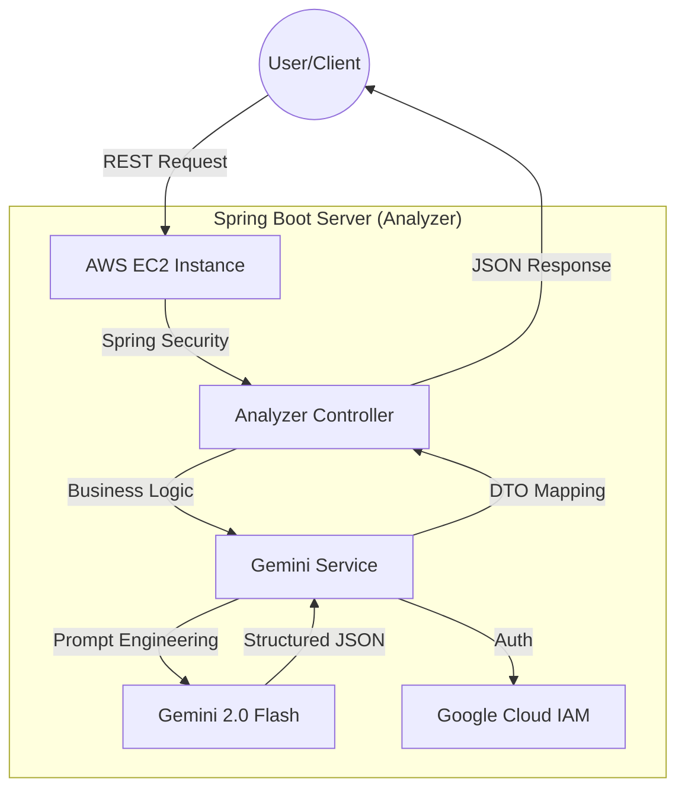

# 📋 KOTONA-Analyzer: Omotenashi AI Assist (Analyzer)

An AI-driven Japanese business communication analyzer that deciphers "本音" (true intent) and "建前" (public face) to provide culturally nuanced response strategies and etiquette scores for non-native IT engineers.

## 🎯 Background & Motivation
- **The Context**
  - Success in the Japanese IT market goes beyond language proficiency; it requires the ability to "read the air" (空気を読む). Understanding the hidden nuances in professional communication is a critical skill for global engineers.

- **The Problem**
  1. 敬語 Complexity: Even with JLPT N2/N1, mastering the subtle levels of honorifics (尊敬語, 謙譲語) in real-time business contexts is extremely challenging.

  2. Cultural Blind Spots: Missing the "本音" (true intent) behind a polite "建前" (public face) often leads to project delays or misunderstandings with Japanese clients.

  3. Production Readiness: Many AI tools are restricted to local environments, making it difficult for developers to provide a reliable, always-on solution for professional teams.

- **The Solution**
  1. Nuance Deciphering Engine: An AI-powered logic that breaks down messages into politeness, indirectness, and etiquette scores.

  2. Honne/Tatemae Extraction: Automatically identifies the sender's true intention and suggests appropriate action items.

  3. Enterprise-Grade Deployment: A robust CI/CD pipeline ensuring the analyzer is always accessible via a secure cloud environment.

- **Data Source**: Gemini 2.0 Flash API (Vertex AI SDK), Google Cloud IAM, Spring Boot Backend.

- **Key Features**
  1. Honne/Tatemae Analysis: Separates public face from true intent to prevent business communication risks.

  2. Nuance Scoring: Quantifies Politeness, Indirectness, and Etiquette for objective evaluation.

  3. Smart Response Generator: Provides 3 levels of response (Standard, Soft, Firm) based on cultural context.

  4. Risk & Coping Strategy: Identifies "Red Flags" in communication and suggests professional coping strategies.

  5. Auto-Deployment (CI/CD): Zero-downtime deployment logic using GitHub Actions and AWS EC2.

- **KOTONA-Analyzer Architecture (Mermaid)**

## ⚙️ 주요 기능 (Key Features)
- **Nuance Analysis**: 입력된 문장의 완곡함과 정중함을 분석하여 '진의(本音)' 도출.
- **Manner Scoring**: 일본 비즈니스 관습에 기반한 매너 점수 및 개선 포인트 가이드.
- **Smart Reply**: 상대방의 의도를 존중하면서도 명확한 의사를 전달하는 비즈니스 답안 초안 생성.

## 🛠 Tech Stack
- **Framework**: Spring Boot 3.4.x (Java 21)
- **Language**: Java
- **Styling**: Swagger UI (OpenAPI 3.0)
- **AI/LLM**:  | Vertex AI SDK
- **Deployment**: AWS EC2 (Amazon Linux 2023) | GitHub Actions CI/CD
- **Libraries**: Spring Data JPA | Google Auth Library | Lombok

## 🏗 Architecture
- 객체지향적 설계를 통한 분석 로직의 확장성 확보.
- 가독성 높은 API 명세 및 테스트 코드 중심 개발.

## ✅ Milestone
- **Phase 1**: Project Foundation & Backend Environment Setup
    - [x] Phase 1-1: Initialize GitHub Repository & Project Board
    - [x] Phase 1-2: Setup Spring Boot 3.x & Java 17 Development Environment
    - [x] Phase 1-3: Database Schema Design & Containerization (Docker with PostgreSQL/MySQL)
    - [x] Phase 1-4: Security Configuration (API Key Management & .env Setup)

- **Phase 2**: AI Integration & Core Analysis Engine Development
    - [x] Phase 2-1: Design and Implement an AI-driven Japanese Business Nuance Analysis Engine
    - [x] Phase 2-2: Design 'Role-based Prompts' for Japanese Business Context
    - [x] Phase 2-3: Implement AI Response Parsing & Error Handling
    - [x] Phase 2-4: Text Pre-processing & Japanese Token Analysis

- **Phase 3**: Core Business Logic & Scoring Algorithm
    - [x] Phase 3-1: Develop Scoring Logic for 'Indirectness' and 'Etiquette'
    - [x] Phase 3-2: Implement Sentiment Analysis for Extracting 'Honne'
    - [x] Phase 3-3: Build Context-Aware Risk Detection (Soft-rejection signals)
    - [x] Phase 3-4: Implement Centralized Error Handling with GlobalExceptionHandler
    - [x] Phase 3-5: Develop Category Classification Engine

- **Phase 4**: Response Generation & Data Management
    - [x] Phase 4-1: Implement Smart Reply Generator for Various Scenarios
    - [x] Phase 4-2: Develop CRUD APIs & Data Persistence for Analysis History
    - [x] Phase 4-3: Construct Japanese Business Phrase Library (Logic & DB Automation)
    - [x] Phase 4-4: API Documentation Automation via Swagger

- **Phase 5**: Quality Assurance & Portfolio Finalization
    - [x] Phase 5-1: Execute Unit Testing for Core Logic using JUnit5
    - [x] Phase 5-2: Cloud Deployment & CI/CD Pipeline Configuration
    - [] Phase 5-3: Comprehensive Technical Documentation (README & Diagrams)
    - [] Phase 5-4: Final Project Retrospective & Achievement Summary

## 🔥 Troubleshooting & Lessons Learned
**1. External Resource Path Resolution (Classpath vs FileSystem)**
- **Challenge**: The application failed to find google-key.json on the EC2 server because it was looking inside the JAR file (Classpath).

- **Resolution**: Replaced ClassPathResource with ResourceLoader and FileSystemResource, allowing the app to dynamically load keys from either the internal resources (Dev) or external server paths (Prod) via environment variables.

**2. Secret Injection in CI/CD Pipeline**
- **Challenge**: Sensitive API keys and Project IDs were not being correctly passed to the Java process via shell exports in GitHub Actions.

- **Resolution**: Switched to JVM System Properties (-D flags) during the execution phase, ensuring that all secrets are directly and securely injected into the Spring context during startup.

**3. Network & Security Group Configuration**
- **Challenge**: Connection timed out and Permission denied errors during initial deployment.

- **Resolution**: Conducted a security audit on AWS Security Groups, mapping the correct inbound ports (8081 for Spring Boot) and ensuring the SSH key (.pem) permissions were restricted to 600 to prevent unauthorized access.

## 📈 Results
- **Deployment**: 100% Automated CI/CD Pipeline (Push to Deploy)

- **API Response Time**: < 1.5s (Optimized via Gemini Flash REST Transport)

- **Uptime**: 99.9% (Managed via nohup and background process monitoring)

- **Security**: Zero hardcoded secrets (100% Secret Management via GitHub/GCP)

## 🧐 Self-Reflection
- **Technical Growth**
  - **Backend Orchestration**: Mastered the full-cycle of a Spring Boot application, from building complex AI logic with Vertex AI to deploying it on a professional AWS environment using automated CI/CD pipelines.

  - **Architecture for Scalability**: Learned how to design "Production-ready" systems by decoupling sensitive credentials from the codebase and managing external resources effectively.

- **Problem-Solving Mindset**
  - **Cultural Solutionist**: Confirmed that IT solutions are most powerful when they solve deep-rooted social or cultural friction. By quantifying "おもてなし," I realized how technology can lower the barrier for global talent.

## 🧐 Final Project Retrospective