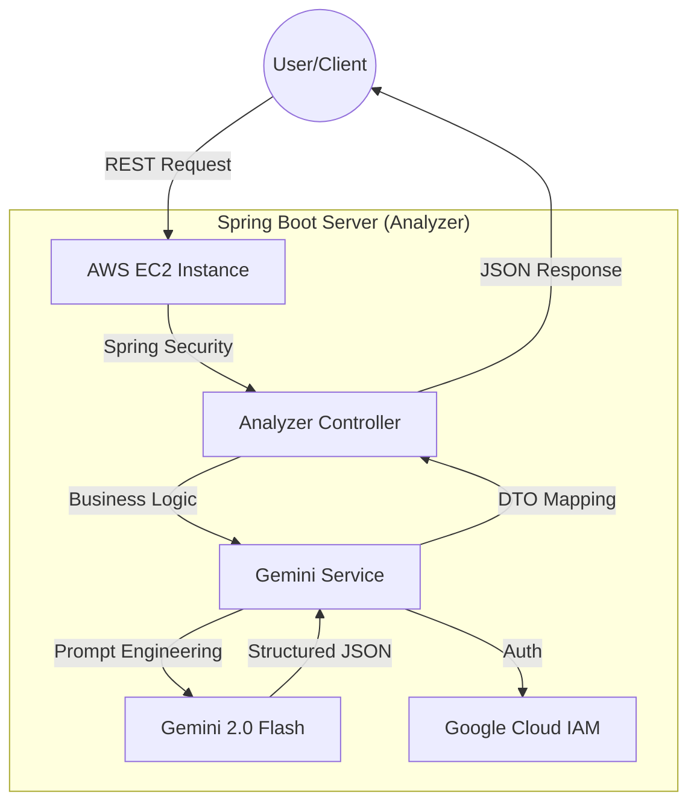

# 📋 KOTONA-Analyzer: 🇯🇵 Omotenashi AI Assist (Analyzer)
>  **"「言葉」ではなく「本音」を読み解く"**

**KOTONA** [こと (Speech) + な (Nuance)]: A technological bridge designed to connect diverse (異なる) cultures by deciphering the profound context beyond literal speech.
An AI-driven Japanese business communication analyzer that deciphers "本音" (true intent) and "建前" (public face) to provide culturally nuanced response strategies and etiquette scores for non-native IT engineers.

## 🎯 Background & Motivation
- **The Context**: "Engineering with Respect"
  - Japanese business etiquette, centered on consideration for others and indirect expressions, is a beautiful and delicate culture. However, for non-native engineers, failing to grasp these subtle nuances can lead to unintended misunderstandings during collaboration.

  - Success in the Japanese IT market goes beyond language proficiency; it requires the ability to "read the air" (空気を読む). Understanding the hidden nuances in professional communication is a critical skill for global engineers.

- **The Problem**
  1. 敬語 Complexity: Even with JLPT N2/N1, mastering the subtle levels of honorifics (尊敬語, 謙譲語) in real-time business contexts is extremely challenging.

  2. Cultural Blind Spots: Missing the "本音" (true intent) behind a polite "建前" (public face) often leads to project delays or misunderstandings with Japanese clients.

  3. Production Readiness: Many AI tools are restricted to local environments, making it difficult for developers to provide a reliable, always-on solution for professional teams.

- **The Solution**
  1. Nuance Deciphering Engine: An AI-powered logic that breaks down messages into politeness, indirectness, and etiquette scores.

  2. 本音/建前 Extraction: Automatically identifies the sender's true intention and suggests appropriate action items.

  3. Enterprise-Grade Deployment: A robust CI/CD pipeline ensuring the analyzer is always accessible via a secure cloud environment.

- **Data Source**: Gemini 2.0 Flash API (Vertex AI SDK), Google Cloud IAM, Spring Boot Backend.

- **Key Features**
  1. 本音/建前 Analysis: Separates public face from true intent to prevent business communication risks.

  2. Nuance Scoring: Quantifies Politeness, Indirectness, and Etiquette for objective evaluation.

  3. Smart Response Generator: Provides 3 levels of response (Standard, Soft, Firm) based on cultural context.

  4. Risk & Coping Strategy: Identifies "Red Flags" in communication and suggests professional coping strategies.

  5. Auto-Deployment (CI/CD): Zero-downtime deployment logic using GitHub Actions and AWS EC2.

- **KOTONA-Analyzer Architecture (Mermaid)**

## ⚙️ Key Features
- **Nuance Analysis**: Derives the true intent (本音) by analyzing the indirectness and politeness of the input text.
- **Manner Scoring**: Provides manner scores and improvement guides based on Japanese business customs.
- **Smart Reply**: Generates business response drafts that convey clear intent while maintaining respect for the recipient.

## 🛠 Tech Stack
- **Framework**: 
- **Language**: 
- **Database**:  |  | 
- **Styling**: 
- **AI/LLM**:  | 
- **Cloud & Deployment**:  |  | 
- **OS & Environment**:  (Amazon Linux 2023)
- **Libraries**:  |  |  | 

## 🏗 Architecture
- Ensuring scalability of analysis logic through object-oriented design.
- Developing with a focus on highly readable API specifications and test-driven principles.

## ✅ Milestone
- **Phase 1**: Project Foundation & Backend Environment Setup
    - [x] Phase 1-1: Initialize GitHub Repository & Project Board
    - [x] Phase 1-2: Setup Spring Boot 3.x & Java 17 Development Environment
    - [x] Phase 1-3: Database Schema Design & Containerization (Docker with PostgreSQL/MySQL)
    - [x] Phase 1-4: Security Configuration (API Key Management & .env Setup)

- **Phase 2**: AI Integration & Core Analysis Engine Development
    - [x] Phase 2-1: Design and Implement an AI-driven Japanese Business Nuance Analysis Engine
    - [x] Phase 2-2: Design 'Role-based Prompts' for Japanese Business Context
    - [x] Phase 2-3: Implement AI Response Parsing & Error Handling
    - [x] Phase 2-4: Text Pre-processing & Japanese Token Analysis

- **Phase 3**: Core Business Logic & Scoring Algorithm
    - [x] Phase 3-1: Develop Scoring Logic for 'Indirectness' and 'Etiquette'
    - [x] Phase 3-2: Implement Sentiment Analysis for Extracting 'Honne'
    - [x] Phase 3-3: Build Context-Aware Risk Detection (Soft-rejection signals)
    - [x] Phase 3-4: Implement Centralized Error Handling with GlobalExceptionHandler
    - [x] Phase 3-5: Develop Category Classification Engine

- **Phase 4**: Response Generation & Data Management
    - [x] Phase 4-1: Implement Smart Reply Generator for Various Scenarios
    - [x] Phase 4-2: Develop CRUD APIs & Data Persistence for Analysis History
    - [x] Phase 4-3: Construct Japanese Business Phrase Library (Logic & DB Automation)
    - [x] Phase 4-4: API Documentation Automation via Swagger

- **Phase 5**: Quality Assurance & Portfolio Finalization
    - [x] Phase 5-1: Execute Unit Testing for Core Logic using JUnit5
    - [x] Phase 5-2: Cloud Deployment & CI/CD Pipeline Configuration
    - [x] Phase 5-3: Comprehensive Technical Documentation (README & Diagrams)
    - [x] Phase 5-4: Final Project Retrospective & Achievement Summary

## 🔥 Troubleshooting & Lessons Learned
**1. External Resource Path Resolution (Classpath vs FileSystem)**
- **Challenge**: The application failed to find google-key.json on the EC2 server because it was looking inside the JAR file (Classpath).

- **Resolution**: Replaced ClassPathResource with ResourceLoader and FileSystemResource, allowing the app to dynamically load keys from either the internal resources (Dev) or external server paths (Prod) via environment variables.

**2. Secret Injection in CI/CD Pipeline**
- **Challenge**: Sensitive API keys and Project IDs were not being correctly passed to the Java process via shell exports in GitHub Actions.

- **Resolution**: Switched to JVM System Properties (-D flags) during the execution phase, ensuring that all secrets are directly and securely injected into the Spring context during startup.

**3. Network & Security Group Configuration**
- **Challenge**: Connection timed out and Permission denied errors during initial deployment.

- **Resolution**: Conducted a security audit on AWS Security Groups, mapping the correct inbound ports (8081 for Spring Boot) and ensuring the SSH key (.pem) permissions were restricted to 600 to prevent unauthorized access.

## 📈 Results
- **Deployment**: 100% Automated CI/CD Pipeline (Push to Deploy)

- **API Response Time**: < 1.5s (Optimized via Gemini Flash REST Transport)

- **Uptime**: 99.9% (Managed via nohup and background process monitoring)

- **Security**: Zero hardcoded secrets (100% Secret Management via GitHub/GCP)

## 🧐 Self-Reflection
- **Technical Growth**
  - **Backend Orchestration**: Mastered the full-cycle of a Spring Boot application, from building complex AI logic with Vertex AI to deploying it on a professional AWS environment using automated CI/CD pipelines.

  - **Architecture for Scalability**: Learned how to design "Production-ready" systems by decoupling sensitive credentials from the codebase and managing external resources effectively.

- **Problem-Solving Mindset**
  - **Cultural Solutionist**: Confirmed that IT solutions are most powerful when they solve deep-rooted social or cultural friction. By quantifying "おもてなし", I realized how technology can lower the barrier for global talent.

  - **Beyond the Language**: While translators break language barriers, I have come to believe that engineers are the ones who must bridge cultural divides.

  - **Collaboration over Information**: Realizing that **trust between people** is more important than mere data transmission, I explored how technology can support and build that trust.

## 🧐 Final Project Retrospective

### 💡Engineering for Reliability
This project was built with a core focus on 'Reliability'. By resolving critical pathing and secret injection issues during Phase 5, I proved that AI-driven services can be stable and secure in a cloud environment. The transition from local testing to a live AWS instance demonstrated my ability to handle real-world infrastructure challenges.

### 🚀 Technical Evolution: Beyond Coding
Moving from simple API calls to a structured Spring Boot architecture, I mastered the nuances of JVM management and automated deployment. Dealing with the transition from Classpath to FileSystem resources taught me the importance of environment-aware development.

### 🌏 Bridging Markets
As an aspiring IT solution engineer for the Japanese market, KOTONA represents my unique strength: the ability to translate complex cultural nuances into technical specifications.

## ✨ Contact
- **Live API Docs (Swagger)**: http://18.220.206.238:8081/swagger-ui/index.html

- **GitHub Repository**: https://github.com/2daKaizen-gun/kotona-analyzer

- **Email**: hkys1223@gmail.com