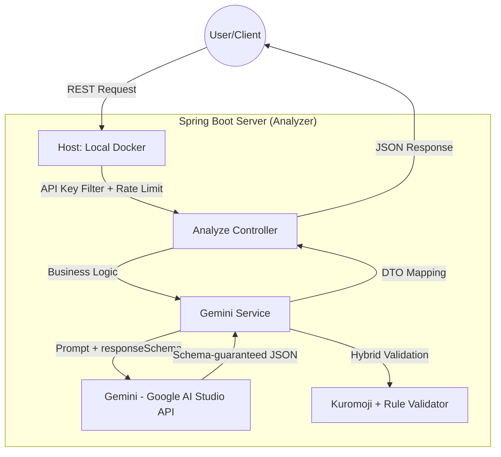

# 📋 KOTONA-Analyzer: 🇯🇵 Omotenashi AI Assist (Analyzer)
>  **"「言葉」ではなく「本音」を読み解く"**
>
> **KOTONA** [こと (Speech) + な (Nuance)]: A technological bridge designed to connect diverse (異なる) cultures by deciphering the profound context beyond literal speech.

An AI-driven Japanese business communication analyzer that deciphers "本音" (true intent) and "建前" (public face) to provide culturally nuanced response strategies and etiquette scores for non-native IT engineers.

## 🎯 Background & Motivation
- **The Context**: "Engineering with Respect"
  - Japanese business etiquette, centered on consideration for others and indirect expressions, is a beautiful and delicate culture. However, for non-native engineers, failing to grasp these subtle nuances can lead to unintended misunderstandings during collaboration.

  - Success in the Japanese IT market goes beyond language proficiency; it requires the ability to "read the air" (空気を読む). Understanding the hidden nuances in professional communication is a critical skill for global engineers.

- **The Problem**
  1. 敬語 Complexity: Even with JLPT N2/N1, mastering the subtle levels of honorifics (尊敬語, 謙譲語) in real-time business contexts is extremely challenging.

  2. Cultural Blind Spots: Missing the "本音" (true intent) behind a polite "建前" (public face) often leads to project delays or misunderstandings with Japanese clients.

  3. Production Readiness: Many AI tools only ever run on the developer's own machine, with nothing to show they still work after the next change — or that a failure reaches the user as a clear message rather than a stack trace.

- **The Solution**
  1. Nuance Deciphering Engine: An AI-powered logic that breaks down messages into politeness, indirectness, and etiquette scores.

  2. 本音/建前 Extraction: Automatically identifies the sender's true intention and suggests appropriate action items.

  3. Portable, Verified Deployment: One `docker compose up` runs the whole stack anywhere Docker runs, and CI builds and tests every push. The frontend is public in demo mode; the analyzer itself is started when needed rather than hosted, since a JVM app with MySQL and 79-second requests is a paid shape.

- **Data Source**: Gemini via Google AI Studio (Google Gen AI Java SDK) with schema-enforced JSON output, Spring Boot Backend.

- **Key Features**
  1. 本音/建前 Analysis: Separates public face from true intent to prevent business communication risks.

  2. Nuance Scoring: Quantifies Politeness, Indirectness, and Etiquette for objective evaluation.

  3. Smart Response Generator: Provides 3 levels of response (Standard, Soft, Firm) based on cultural context.

  4. Risk & Coping Strategy: Identifies "Red Flags" in communication and suggests professional coping strategies.

  5. Portable Deployment: Runs fully locally via a single `docker compose up` (app + MySQL), with a GitHub Actions pipeline that builds and tests on every push. It previously deployed to AWS EC2 on manual dispatch; that instance was retired when the free tier ended.

- **KOTONA-Analyzer Architecture (Mermaid)**


## 🧩 Repositories
KOTONA is split across two repositories:

| Repo | Role |
|---|---|
| **kotona-analyzer** (this repo) | Spring Boot API — analysis engine, hybrid validation, Gemini integration |
| **[kotona-web](https://github.com/2daKaizen-gun/kotona-web)** | Next.js frontend — talks to this API through a server-side BFF so the API key never reaches the browser. **Live: https://kotona-web.vercel.app/** |

The deployed site runs on prepared samples rather than calling this service — hosting a JVM app with MySQL and 79-second requests is a paid shape, so only the frontend is deployed. It says so on every page. Pointing it at a real backend is an environment-variable change, not a code change.

The frontend generates its TypeScript types from this service's OpenAPI spec (`GET /v3/api-docs`), so a field added to `NuanceResponseDTO` propagates without being declared twice.

## 🚀 Getting Started (Local, Dockerized)
The whole stack (Spring Boot app + MySQL) runs locally with a single command — no cloud dependency. This is the primary way to run KOTONA after the AWS free tier.

```bash
# 1) Set secrets (create .env in project root)
#    GEMINI_API_KEY=...             # required: https://aistudio.google.com/apikey
#    API_KEY=<your-api-key>         # optional: protects POST /analyze when set
#    GEMINI_MODEL=gemini-3.6-flash  # optional: this is the default. Free tier eligible.
# 2) Run everything (no service account key file, no GCP project, no billing account)
docker compose up -d --build
```
- API base: `http://localhost:8081`
- Swagger UI: `http://localhost:8081/swagger-ui/index.html`
- Analyze (POST): `POST /analyze` with body `{ "text": "...", "relationshipType": "EXTERNAL" }` and header `X-API-KEY: <API_KEY>` when configured. `relationshipType` is one of `INTERNAL` / `EXTERNAL` / `INTERVIEW`; anything else is refused with the allowed list.

> **API route note**: KOTONA talks to Gemini through the **AI Studio** endpoint (a plain API key), not Vertex AI.
> That is what removes the service-account JSON, the GCP project, the billing account, and the recurring
> terms-of-service re-acceptance. `GEMINI_MODEL` defaults to `gemini-3.6-flash`, which is free-tier eligible.
>
> Do not set it to `gemini-2.5-flash`. That model answers
> `404 ... no longer available to new users` on keys issued recently, which is why the default moved off it.
>
> Note that free-tier traffic may be used by Google to improve their products — use a paid tier for real
> client correspondence.

> Security: `/analyze` is protected by an **API Key filter** (`X-API-KEY`, enforced only when `API_KEY` is set) and a **per-IP rate limiter**. `GET`-based analysis was replaced by `POST` since the call mutates state (DB write) and invokes a paid AI API.

## 📡 API

Full schema at `GET /v3/api-docs`; Swagger UI at `/swagger-ui/index.html`. The frontend generates its
TypeScript types from that spec, so the response shapes below are never declared twice.

| Method | Path | Notes |
|---|---|---|
| `POST` | `/analyze` | The paid call. Body `{ text, relationshipType }`; `text` is at most 2,000 characters (and any body over 64 KB is refused unread), `relationshipType` is `INTERNAL` / `EXTERNAL` / `INTERVIEW` and defaults to `INTERNAL`. Takes 20–30s. |
| `GET` | `/api/history` | Page of summaries, newest first. `?page=0&size=20`; `size` is capped at 100. |
| `GET` | `/api/history/{id}` | One record including the stored analysis. |
| `DELETE` | `/api/history/{id}` | 204 on success, like the dictionary. |
| `GET` | `/api/phrases` | Dictionary, most polite first. |
| `GET` | `/api/phrases/search?situation=` | Filter by situation. |
| `POST` | `/api/phrases` | |
| `PUT` | `/api/phrases/{id}` | |
| `DELETE` | `/api/phrases/{id}` | |
| `GET` | `/api/health` | |

**The history list carries summaries, not results.** Each stored analysis is a couple of kilobytes of
JSON, and a list row shows six short fields. Returning every row with its result attached meant the
response grew forever and most of it was never read — so the list omits it and `/api/history/{id}`
fetches one when a row is actually expanded.

**Protected when `API_KEY` is set**: `/analyze`, everything under `/api/history`, and dictionary
writes. Dictionary reads, health and Swagger stay open. With `API_KEY` unset the filter logs a
warning and lets everything through, which is what makes local development frictionless — and what
makes setting it mandatory before exposing the service.

**Errors** are `{"error": "..."}` with a meaningful status: 413 a body over 64 KB and 411 a body that does not declare its length — both refused before anything is read, since `@Size` only judges after the body has been parsed. 400 invalid input (including a
relationship or situation outside its enum), 404 unknown id, 409 duplicate phrase, 429 rate
limited (20 requests/minute/IP on `/analyze`) or model quota exhausted, 502 anything else from
the model. Upstream response bodies are logged, never returned — and so is the message of any
error we did not classify, since that text belongs to a JDBC driver or the JDK, not to us.

## 🗄 Schema

Flyway owns the schema; Hibernate runs with `ddl-auto: validate` and refuses to start if the
entities and the tables disagree. Migrations live in `src/main/resources/db/migration`.

| File | Runs |
|---|---|
| `V1__baseline.sql` | Once, on a database that does not have it. Existing databases are baselined at V1 and skip it. |
| `R__seed_default_phrases.sql` | Whenever the file changes — it is the single source for the default dictionary. |

**V1 was transcribed from the live database, not from the old `schema.sql`.** Those two disagreed:
`schema.sql` declared `category VARCHAR(50)` and `risk_level VARCHAR(20)` where both are
`varchar(255)`, because Hibernate created the tables from the entities and `CREATE TABLE IF NOT
EXISTS` skipped the script every time. Writing V1 from the script would have made fresh databases
differ from existing ones.

Adding a column means adding `V2__...sql` and the field on the entity. `validate` will tell you at
startup if they do not match, which is the point — `update` used to add columns silently and never
remove or narrow one, so a deleted field left its column behind forever and a rename produced two.

## ⚙️ Key Features
- **Nuance Analysis**: Derives the true intent (本音) by analyzing the indirectness and politeness of the input text.
- **Manner Scoring**: Provides manner scores and improvement guides based on Japanese business customs.
- **Smart Reply**: Generates business response drafts that convey clear intent while maintaining respect for the recipient.

## 🛠 Tech Stack
- **Framework**: 
- **Language**: 
- **Database**:  |  | 
- **AI/LLM**:  | 
- **Cloud & Deployment**:  | 
- **OS & Environment**:  (Amazon Linux 2023)
- **Libraries**:  |  |  | 

> The AWS EC2 and Amazon Linux entries record where this ran in production until the free tier ended. The deployment target is gone; the app now runs anywhere Docker does.

## 🏗 Architecture
- Ensuring scalability of analysis logic through object-oriented design.
- Developing with a focus on highly readable API specifications and test-driven principles.

## ✅ Milestone
- **Phase 1**: Project Foundation & Backend Environment Setup
    - [x] Phase 1-1: Initialize GitHub Repository & Project Board
    - [x] Phase 1-2: Setup Spring Boot 3.x & Java 21 Development Environment
    - [x] Phase 1-3: Database Schema Design & Containerization (Docker with MySQL)
    - [x] Phase 1-4: Security Configuration (API Key Management & .env Setup)

- **Phase 2**: AI Integration & Core Analysis Engine Development
    - [x] Phase 2-1: Design and Implement an AI-driven Japanese Business Nuance Analysis Engine
    - [x] Phase 2-2: Design 'Role-based Prompts' for Japanese Business Context
    - [x] Phase 2-3: Implement AI Response Parsing & Error Handling
    - [x] Phase 2-4: Text Pre-processing & Japanese Token Analysis

- **Phase 3**: Core Business Logic & Scoring Algorithm
    - [x] Phase 3-1: Develop Scoring Logic for 'Indirectness' and 'Etiquette'
    - [x] Phase 3-2: Implement Sentiment Analysis for Extracting 'Honne'
    - [x] Phase 3-3: Build Context-Aware Risk Detection (Soft-rejection signals)
    - [x] Phase 3-4: Implement Centralized Error Handling with GlobalExceptionHandler
    - [x] Phase 3-5: Develop Category Classification Engine

- **Phase 4**: Response Generation & Data Management
    - [x] Phase 4-1: Implement Smart Reply Generator for Various Scenarios
    - [x] Phase 4-2: Develop CRUD APIs & Data Persistence for Analysis History
    - [x] Phase 4-3: Construct Japanese Business Phrase Library (Logic & DB Automation)
    - [x] Phase 4-4: API Documentation Automation via Swagger

- **Phase 5**: Quality Assurance & Portfolio Finalization
    - [x] Phase 5-1: Execute Unit Testing for Core Logic using JUnit5
    - [x] Phase 5-2: Cloud Deployment & CI/CD Pipeline Configuration
    - [x] Phase 5-3: Comprehensive Technical Documentation (README & Diagrams)
    - [x] Phase 5-4: Final Project Retrospective & Achievement Summary

## 🔥 Troubleshooting & Lessons Learned
**1. External Resource Path Resolution (Classpath vs FileSystem)** *(historical — resolved by removing the key file entirely)*
- **Challenge**: The application failed to find the GCP service-account key on the EC2 server because it was looking inside the JAR file (Classpath).

- **Resolution (then)**: Replaced ClassPathResource with ResourceLoader, allowing the app to load the key from internal resources (Dev) or an external server path (Prod).

- **Resolution (now)**: The whole class of problem disappeared when the backend moved to the AI Studio endpoint — API-key auth needs no key file, so there is nothing to resolve a path for and nothing that can be accidentally baked into the JAR.

**2. Secret Injection in CI/CD Pipeline**
- **Challenge**: Sensitive API keys were not being correctly passed to the Java process via shell exports in GitHub Actions.

- **Resolution**: Secrets are injected as **environment variables** on the remote launch command. An earlier version used JVM system properties (`-D` flags), but those land in the process command line where any user on the box can read them via `ps` — environment variables are readable only by the process owner.

**3. Network & Security Group Configuration**
- **Challenge**: Connection timed out and Permission denied errors during initial deployment.

- **Resolution**: Conducted a security audit on AWS Security Groups, mapping the correct inbound ports (8081 for Spring Boot) and ensuring the SSH key (.pem) permissions were restricted to 600 to prevent unauthorized access.

**4. Choosing the Right Door to the Same Model (Vertex AI vs. AI Studio)**
- **Challenge**: The original integration reached Gemini through **Vertex AI**, which demanded a GCP project, an IAM service account, a downloaded JSON key, an active billing account, and repeated terms-of-service re-acceptance — heavy machinery for what is ultimately one text-in/JSON-out call. The friction was blamed on the model; it actually belonged to the access path.

- **Resolution**: Switched to the **AI Studio** endpoint via the Google Gen AI Java SDK. Same model family, but authentication collapses to a single API key with no billing account required, and the free tier covers this workload. Along the way the response contract was hardened: the JSON Schema is now generated from the `NuanceResponseDTO` record tree and enforced by `responseSchema`, which deleted both the hand-written schema block in the prompt and the markdown-fence-stripping regex that used to guard against malformed JSON.

- **Lesson**: When a dependency feels heavy, check whether you are on the wrong on-ramp before you replace the destination.

## 📈 Results
- **Deployment**: Portable — one-command local run via `docker compose up` (app + MySQL); GitHub Actions builds and runs the test suite on every push. The EC2 deployment job was removed with the instance; the pipeline that ran it is in the git history

- **API Response Time**: usually 20–30 seconds, with a long tail (79s observed). The dominant lever is `GEMINI_THINKING_LEVEL`, which defaults to `high` on purpose — at `low` the model mixes Korean and English into the Japanese replies and two of every three get discarded (see `PROMPT_DESIGN.md`). `GEMINI_MODEL` is the second lever

- **Test Coverage**: 200 backend tests covering 96% of lines and 87% of branches, plus 138 unit and 12 browser tests in [kotona-web](https://github.com/2daKaizen-gun/kotona-web), which is measured too — 94% of lines there. Both CIs print the totals and the least-covered files in the run summary and fail below a floor. Measuring is what found the gaps worth fixing: on the backend, the save path behind every analysis at 0% and a politeness check that marked 「ご確認ください」 as impolite; on the frontend, the dictionary screen at 60%, with editing, deleting and paging untested.

- **Reaching the real API**: `./gradlew test` never calls Gemini — `NuanceModelClient` is swapped for a fake, so the suite is free, fast and deterministic. That leaves the SDK call itself unexercised, so it has its own test behind a tag: `GEMINI_API_KEY=... ./gradlew liveTest` spends one call and checks the answer still parses into `NuanceResponseDTO`. Worth running after an SDK upgrade or a model change; deliberately not in CI, which would spend quota on every push

- **Portability**: No single-cloud lock-in — runs anywhere Docker runs, enabling zero-downtime migration off the retired EC2 free tier

- **Security**: Zero hardcoded secrets and zero key files on disk — a single `GEMINI_API_KEY` env var replaced the GCP service-account JSON. `/analyze`, the analysis history and dictionary writes are behind an API-key filter, with a per-IP rate limiter on the paid endpoint

## 🧐 Self-Reflection
- **Technical Growth**
  - **Backend Orchestration**: Mastered the full-cycle of a Spring Boot application, from building complex AI logic on a generative model API to deploying it on a professional AWS environment using automated CI/CD pipelines.

  - **Architecture for Scalability**: Learned how to design "Production-ready" systems by decoupling sensitive credentials from the codebase and managing external resources effectively.

- **Problem-Solving Mindset**
  - **Cultural Solutionist**: Confirmed that IT solutions are most powerful when they solve deep-rooted social or cultural friction. By quantifying "おもてなし", I realized how technology can lower the barrier for global talent.

  - **Beyond the Language**: While translators break language barriers, I have come to believe that engineers are the ones who must bridge cultural divides.

  - **Collaboration over Information**: Realizing that **trust between people** is more important than mere data transmission, I explored how technology can support and build that trust.

## 🧐 Final Project Retrospective

### 💡Engineering for Reliability
This project was built with a core focus on 'Reliability'. By resolving critical pathing and secret injection issues during Phase 5, I proved that AI-driven services can be stable and secure in a cloud environment. The transition from local testing to a live AWS instance (since retired with the free tier — see Results) demonstrated my ability to handle real-world infrastructure challenges.

### 🚀 Technical Evolution: Beyond Coding
Moving from simple API calls to a structured Spring Boot architecture, I mastered the nuances of JVM management and automated deployment. Dealing with the transition from Classpath to FileSystem resources taught me the importance of environment-aware development.

### 🌏 Bridging Markets
As an aspiring IT solution engineer for the Japanese market, KOTONA represents my unique strength: the ability to translate complex cultural nuances into technical specifications.

## ✨ Contact
- **API Docs (Swagger, local)**: `http://localhost:8081/swagger-ui/index.html` — run via `docker compose up`
  > The AWS EC2 live instance was retired after the free tier ended; the app now runs locally via Docker (app + MySQL).

- **GitHub Repository**: https://github.com/2daKaizen-gun/kotona-analyzer

- **Email**: hkys1223@gmail.com