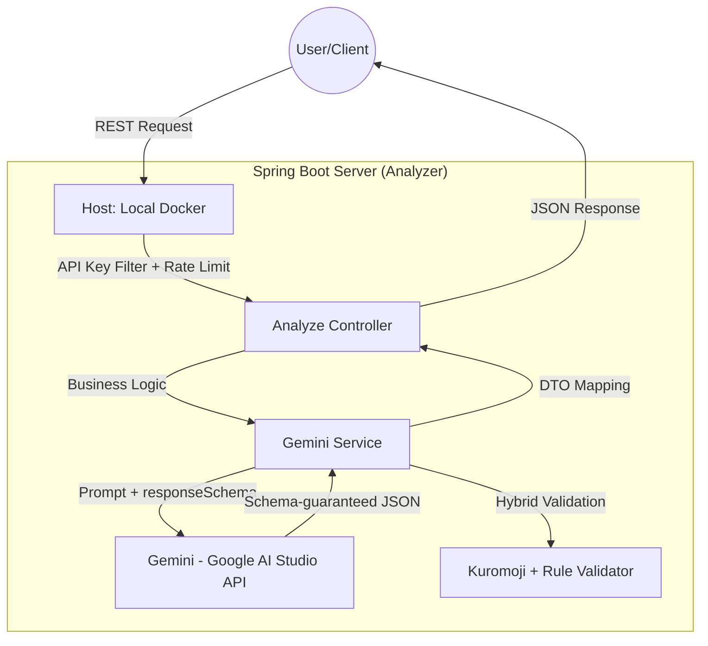

# 📋 KOTONA-Analyzer: 🇯🇵 Omotenashi AI Assist (Analyzer)
>  **"「言葉」ではなく「本音」を読み解く"**
>
> **KOTONA** [こと (Speech) + な (Nuance)]: A technological bridge designed to connect diverse (異なる) cultures by deciphering the profound context beyond literal speech.

An AI-driven Japanese business communication analyzer that deciphers "本音" (true intent) and "建前" (public face) to provide culturally nuanced response strategies and etiquette scores for non-native IT engineers.

Spring Boot 4 · Java 21 · MySQL 8 · Gemini via Google AI Studio

## ✅ Verified

Each line below names a command. Run it and you get the number — that is the only kind of claim in this
table. Anything that cannot be checked this way is in [What is still unverified](#what-is-still-unverified)
instead, with its denominator.

| what | measured | how to check it |
|---|---|---|
| Backend tests | **214** passing | `./gradlew test` — runs on every push |
| Backend coverage | **96.49%** lines, **86.14%** branches (97.06% of instructions) | `./gradlew check` — JaCoCo floors of 0.90 lines / 0.80 branches are wired into `check`, so this cannot quietly fall |
| Frontend tests | **142** unit, **12** browser | `npm test` and `npm run test:browser` in [kotona-web](https://github.com/2daKaizen-gun/kotona-web) |
| Frontend coverage | **94%** lines | `npm run test:coverage` — thresholds in `vitest.config.mts` |
| Polite form, rules vs. labels | **34 / 34** | `./gradlew test --tests '*RuleLayerEvaluationTest'` |
| Cushion phrase, rules vs. labels | **34 / 34** | same test |
| Refusal signals caught, of the risky sentences | **12 / 13** | same test — held as a floor, not a target; the one miss is explained below |
| False alarms, of the safe sentences | **0 / 21** | same test — asserted at zero |
| Ordering constraints the rules hold | **7 / 7** | `./gradlew test --tests '*RuleLayerOrderingTest'` — both sentences are given identical model scores, so any difference is the rules' doing |
| Review sheet still matches the evaluation set | every sentence, every pair | `ReviewDocumentTest` — the sheet cannot go stale without the build failing |
| Gemini's request schema | generated from the DTO, no second copy by hand | `NuanceSchemaFactoryTest` |
| The real SDK call still parses | **1** call | `GEMINI_API_KEY=... ./gradlew liveTest` — deliberately outside CI, which would spend quota on every push |
| Model agreement, risk grade | **22 / 34** answered, **20** agreed (91%) | `./gradlew evalTest` — free-tier quota; answers accumulate, see below |
| Model agreement, ordering | **1 / 7** compared, **1** held | same command |
| Why those two fill slowly | **20** requests per day, per model | the free tier's own refusal names it: `GenerateRequestsPerDayPerProjectPerModel-FreeTier`, `limit: 20`, `model: gemini-3.6-flash` |
| Compile and startup warnings | **0** | `./gradlew clean build` with `-Xlint:deprecation` on |
| Known dependency vulnerabilities | **0** | `npm audit --omit=dev`; Dependabot alerts enabled on both repos |

Two of those numbers are small on purpose, and two cannot grow by working harder — [What the measurement
found](#-what-the-measurement-found) explains the first, [What is still
unverified](#what-is-still-unverified) the second.

## 🧪 What the measurement found

A test suite that only ever passes has proved nothing except that it was written afterwards. These are the
defects the numbers above caught — each one was in `main`, each is now held by something that fails if it
comes back.

| what was wrong | how it surfaced | what holds it now |
|---|---|---|
| **Flyway stopped running** after the Boot 4 upgrade. The module was split out, the starter was missing, and migrations silently did not apply — invisible locally, where the schema already existed | CI runs against an empty database: `Schema validation: missing table [analysis_history]` | `spring-boot-starter-flyway`, and a CI job that still starts from an empty database on every push |
| **The save path behind every analysis was untested** — 0% on the branch that writes the history row, in a service whose whole job is to write it | the first coverage report, once JaCoCo was wired into `check` | `AnalysisHistorySaveTest`, plus a 0.90 line floor that fails the build |
| **「ご確認ください」 was scored impolite.** The check looked for です・ます as literal strings, so a 尊敬語 imperative counted as plain speech | the labelled evaluation set, on its first run | Kuromoji conjugation types instead of substrings — polite form **34 / 34** |
| **A missing dictionary entry quietly cost 10 points.** 「恐れ入りますが」 is a cushion phrase; the rules did not know it, so a polite request was penalised as if it had none. Same sentence, same manners, ten points apart — decided by a file, not by the Japanese | cushion agreement against the labels | lemma matching on Kuromoji base forms — cushion **34 / 34** |
| **Base forms then over-matched.** 「考えておきます」 defers, 「貢献したいと考えております」 is an aspiration, and both reduce to 考える — so a sentence about wanting to contribute was read as a brush-off | the false-alarm check on the 21 safe sentences | a companion-lemma requirement (`考える` + `おく`) — false alarms **0 / 21** |
| **The model read `riskLevel` as rudeness.** 「よろしく」 came back `DANGER`: terse, yes, but it refuses nothing. The prompt had asked for two readings at once | the first `evalTest` run against the model | one definition in the prompt and in `@JsonPropertyDescription`, with worked examples; the risk check re-asks whenever the prompt version changes |

Two more were found in the measuring itself. The first `evalTest` spent a day's quota collecting the same
`429` thirty-three times, and the ordering check ran first and left nothing for the sentences; it now stops
after three consecutive failures, asks the cheaper check first, and keeps every answer it has already paid
for in `model-answers.json`.

The split itself was then too coarse. On 2026-10-08 the model answered one call with
`503 UNAVAILABLE. This model is currently experiencing high demand` — not our breakage by any reading, but
not a quota either, so the run went red. Failures are now sorted four ways rather than two: the daily cap
(wait for tomorrow), a per-minute throttle (wait seconds), an overloaded model (wait seconds), and ours
(fail). Only the last one turns the build red.

A per-minute throttle was also being read as the end of the day. The daily cap and the rate limit arrive as
the same `429`; only the retry hint differs — `23h39m` against `5.04s`. On 2026-10-07 one sentence was skipped
on a five-second refusal while the day still had requests left, and it cost a strike toward the three that
end the run. A short hint is now waited out and the sentence asked again; a long one still ends the day.
`ModelCallFailureTest` pins both readings against messages actually received.

And the report it printed was a guess. Every failure was logged as `호출 실패: ClientException` followed by
"quota is empty, stopping" — a conclusion the code had no way to reach. A dead API key, a retired model name
and a rejected schema all produced that same line, a green build and a report blaming the quota. The status
is now read out of the SDK's message: `429 RESOURCE_EXHAUSTED` keeps the run green and prints when the window
reopens, and **any other reason fails the run**, because that is not the day's circumstances, it is a break.
Checked in both directions — a spent quota reports `쿼터 소진 … 23h39m 뒤에 다시 열린다` and passes, a bogus key
reports `400 INVALID_ARGUMENT. API key not valid` and fails.

The one miss that was left in place is 「お声がけいたします」. It defers; 「何かあればお声がけください」
invites; one dictionary entry cannot tell them apart. A false alarm — telling someone a harmless message is
dangerous — is worse than a miss the model may still catch, so recall is held at a floor of 12/13 rather
than driven to 100% by fitting the dictionary to this file.

## 🎯 Background & Motivation
- **The Context**: "Engineering with Respect"
  - Japanese business etiquette, centered on consideration for others and indirect expressions, is a beautiful and delicate culture. However, for non-native engineers, failing to grasp these subtle nuances can lead to unintended misunderstandings during collaboration.

  - Success in the Japanese IT market goes beyond language proficiency; it requires the ability to "read the air" (空気を読む). Understanding the hidden nuances in professional communication is a critical skill for global engineers.

- **The Problem**
  1. 敬語 Complexity: Even with JLPT N2/N1, mastering the subtle levels of honorifics (尊敬語, 謙譲語) in real-time business contexts is extremely challenging.

  2. Cultural Blind Spots: Missing the "本音" (true intent) behind a polite "建前" (public face) often leads to project delays or misunderstandings with Japanese clients.

  3. Production Readiness: Many AI tools only ever run on the developer's own machine, with nothing to show they still work after the next change — or that a failure reaches the user as a clear message rather than a stack trace.

- **The Solution**
  1. Nuance Deciphering Engine: An AI-powered logic that breaks down messages into politeness, indirectness, and etiquette scores.

  2. 本音/建前 Extraction: Automatically identifies the sender's true intention and suggests appropriate action items.

  3. Portable, Verified Deployment: One `docker compose up` runs the whole stack anywhere Docker runs, and CI builds and tests every push. The frontend is public in demo mode; the analyzer itself is started when needed rather than hosted, since a JVM app with MySQL and 79-second requests is a paid shape.

- **Data Source**: Gemini via Google AI Studio (Google Gen AI Java SDK) with schema-enforced JSON output, Spring Boot Backend.

- **Key Features**
  1. 本音/建前 Analysis: Separates public face from true intent to prevent business communication risks.

  2. Nuance Scoring: Breaks a message into politeness, indirectness and etiquette, and says which rule changed which number. It is a model's judgement with a rule layer over it, not a measurement — see [What the score is](#-what-the-score-is).

  3. Smart Response Generator: Provides 3 levels of response (Standard, Soft, Firm) based on cultural context.

  4. Risk & Coping Strategy: Identifies "Red Flags" in communication and suggests professional coping strategies.

  5. Portable Deployment: Runs fully locally via a single `docker compose up` (app + MySQL), with a GitHub Actions pipeline that builds and tests on every push. It previously deployed to AWS EC2 on manual dispatch; that instance was retired when the free tier ended.

- **KOTONA-Analyzer Architecture (Mermaid)**

```mermaid
graph TD
  User((User/Client)) -->|REST Request| Host[Host: Local Docker]
  subgraph "Spring Boot Server (Analyzer)"
    Host -->|API Key Filter + Rate Limit| Controller[Analyze Controller]
    Controller -->|Business Logic| Service[Gemini Service]
    Service -->|Prompt + responseSchema| Gemini[Gemini - Google AI Studio API]
    Service -->|Hybrid Validation| Validator[Kuromoji + Rule Validator]
  end
  Gemini -->|Schema-guaranteed JSON| Service
  Service -->|DTO Mapping| Controller
  Controller -->|JSON Response| User
```

## 🧩 Repositories
KOTONA is split across two repositories:

| Repo | Role |
|---|---|
| **kotona-analyzer** (this repo) | Spring Boot API — analysis engine, hybrid validation, Gemini integration |
| **[kotona-web](https://github.com/2daKaizen-gun/kotona-web)** | Next.js frontend — talks to this API through a server-side BFF so the API key never reaches the browser. **Live: https://kotona-web.vercel.app/** |

The deployed site runs on prepared samples rather than calling this service — hosting a JVM app with MySQL and 79-second requests is a paid shape, so only the frontend is deployed. It says so on every page. Pointing it at a real backend is an environment-variable change, not a code change.

The frontend generates its TypeScript types from this service's OpenAPI spec (`GET /v3/api-docs`), so a field added to `NuanceResponseDTO` propagates without being declared twice.

## 🚀 Getting Started (Local, Dockerized)
The whole stack (Spring Boot app + MySQL) runs locally with a single command — no cloud dependency. This is the primary way to run KOTONA after the AWS free tier.

```bash
# 1) Set secrets (create .env in project root)
#    GEMINI_API_KEY=...             # required: https://aistudio.google.com/apikey
#    API_KEY=<your-api-key>         # optional: protects POST /analyze when set
#    GEMINI_MODEL=gemini-3.6-flash  # optional: this is the default. Free tier eligible.
# 2) Run everything (no service account key file, no GCP project, no billing account)
docker compose up -d --build
```
- API base: `http://localhost:8081`
- Swagger UI: `http://localhost:8081/swagger-ui/index.html`
- Analyze (POST): `POST /analyze` with body `{ "text": "...", "relationshipType": "EXTERNAL" }` and header `X-API-KEY: <API_KEY>` when configured. `relationshipType` is one of `INTERNAL` / `EXTERNAL` / `INTERVIEW`; anything else is refused with the allowed list.

### Configuration

Everything is an environment variable with a working default, so a clone runs without a config file. Only `GEMINI_API_KEY` has no usable default — the app refuses to start without it.

| Variable | Default | What it does |
|---|---|---|
| `GEMINI_API_KEY` | *(none)* | Required. https://aistudio.google.com/apikey |
| `GEMINI_MODEL` | `gemini-3.6-flash` | Free-tier eligible. Do not set `gemini-2.5-flash`; new keys get a 404 |
| `GEMINI_THINKING_LEVEL` | `high` | `low` is faster and mixes languages into the Japanese replies — see `PROMPT_DESIGN.md` |
| `GEMINI_MAX_OUTPUT_TOKENS` | `8000` | Three smart replies plus alternatives, in Japanese and Korean |
| `GEMINI_TEMPERATURE` | `0.0` | Scoring is a judgement, not a draft. At 0.7 the same sentence scored 70/71/71 overall but 15/10/12 on etiquette across three identical requests |
| `API_KEY` | *(none)* | When set, `X-API-KEY` is required on `/analyze`, history and dictionary writes. Unset, the filter logs a warning and lets everything through |
| `DB_HOST` / `DB_PORT` | `127.0.0.1` / `3306` | `docker compose` sets these for the container network |
| `DB_NAME` | `kotona` | Created on first connect if missing |
| `DB_USERNAME` / `DB_PASSWORD` | `root` / `1234` | Local defaults; CI uses the same so the workflow needs no secrets |
| `CORS_ALLOWED_ORIGINS` | `http://localhost:3000,http://localhost:5173` | Comma-separated. Patterns allowed, and pinned by `WebConfigCorsTest` |
| `TRUST_FORWARDED_FOR` | `false` | Whether the rate limiter believes `X-Forwarded-For`. Only turn it on behind a proxy that overwrites the header, or an IP can be spoofed to bypass the limit |
| `SPRINGDOC_ENABLED` | `true` | Serves `/v3/api-docs` and Swagger UI. The spec is what the frontend generates its types from |

> **API route note**: KOTONA talks to Gemini through the **AI Studio** endpoint (a plain API key), not Vertex AI.
> That is what removes the service-account JSON, the GCP project, the billing account, and the recurring
> terms-of-service re-acceptance. `GEMINI_MODEL` defaults to `gemini-3.6-flash`, which is free-tier eligible.
>
> Do not set it to `gemini-2.5-flash`. That model answers
> `404 ... no longer available to new users` on keys issued recently, which is why the default moved off it.
>
> Note that free-tier traffic may be used by Google to improve their products — use a paid tier for real
> client correspondence.

> Security: `/analyze` is protected by an **API Key filter** (`X-API-KEY`, enforced only when `API_KEY` is set) and a **per-IP rate limiter**. `GET`-based analysis was replaced by `POST` since the call mutates state (DB write) and invokes a paid AI API.

## 🔍 What the score is

[`docs/SCORE_PATH.md`](docs/SCORE_PATH.md) follows one sentence through the whole path on a single page —
normalize, morphology, model, rules, adjustment record, UI — with the test that holds each stage. This
section is about what stands behind the numbers it produces.

A number out of 100 looks like a measurement. This one is a model's judgement, adjusted by a layer of rules, and it is worth being precise about what stands behind each part.

**The model's part has no ground truth.** Gemini is asked to rate politeness, indirectness and etiquette. Nothing verifies those ratings against an authority, because no such labelled corpus exists here. What exists is `src/test/resources/evaluation/business-sentences.json`: 34 Japanese business sentences, each labelled on three axes, each axis carrying its own basis. Twenty-four were written here; ten came from a reviewer as expressions that cause trouble in practice, and their labels were re-derived rather than taken on trust.

Those bases are not all the same kind of claim, and the file distinguishes them:

| axis | what the label rests on |
|---|---|
| polite form | the categories in [文化庁「敬語の指針」(2007)](https://www.bunka.go.jp/seisaku/bunkashingikai/kokugo/hokoku/pdf/keigo_tosin.pdf) — 丁寧語 for です・ます, 謙譲語Ⅰ for 伺う・申し上げる, 謙譲語Ⅱ for いたす・おる, 尊敬語 for くださる・なさる. Decidable from a published standard |
| cushion phrase | business convention. Manner references agree on the core set (お手数ですが・恐れ入りますが・差し支えなければ・申し訳ございませんが) but none is official |
| refusal signal | business convention — 「検討します」 and 「難しい」 as indirect refusals. Same status: widely documented, no single authority |

**No native speaker has reviewed any of it.** The first axis stands on a published standard; the other two stand on the author's reading of a convention. That difference matters more than a single disclaimer, which is why it is in the table.

**The rule layer is measured against those labels on every push.** `RuleLayerEvaluationTest` scores the dictionaries and the morphological check:

| axis | agreement |
|---|---|
| polite form (Kuromoji) | 34/34 |
| cushion phrase | 34/34 |
| refusal signal, recall | 12/13 |
| refusal signal, false alarms | 0/21 |

Each number moved because the evaluation found something. Matching raw strings missed 「恐れ入りますが」 and 「考えておきます」, so matching is on Kuromoji base forms now. The ten added sentences then dropped recall to 7 of 13 — 「ご希望に添いかねます」「予定はございません」「持ち帰らせていただく」「善処いたします」 all read as safe — and five of the six were recovered by extending the dictionaries.

**The sixth was left missed on purpose.** 「お声がけいたします」 defers; 「何かあればお声がけください」 invites. One dictionary entry cannot tell them apart, and a false alarm — telling someone a harmless message is dangerous — is worse than a miss, which the model may still catch. So recall is held to a floor rather than to 100%: demanding perfection from a keyword dictionary over arbitrary Japanese would only produce a dictionary overfitted to this file. False alarms are asserted at zero.

**The three metrics have ordering constraints.** No source says 「ご確認ください」 is 35 out of 40, so there is nothing to compare an absolute score against. Ordering is another matter: 「よろしく」 cannot be more polite than 「よろしくお願い申し上げます」, and adding a cushion phrase to a request cannot lower its etiquette. `ordering-pairs.json` holds seven such pairs with the grammatical reason for each, and `RuleLayerOrderingTest` gives both sentences identical model scores so that any difference is the rules' doing. All seven hold; `evalTest` runs the same check against the model, at two calls per pair.

**The weights are still chosen by hand.** 40/30/30, the −10/−10/−5 penalties, the 0.8/0.6/0.5/0.2 signal weights, the 0.3/0.7 grade boundaries, the 1.0/1.2/1.5 relationship multipliers. None is derived from data. What changed is that they are no longer free to drift: they have to reproduce the grades on all 34 labelled sentences, so changing one breaks the build.

**The model's agreement is measured by hand**, not in CI — one sentence costs 20–80 seconds and free-tier quota. `./gradlew evalTest` asserts nothing about the agreement itself: there is no basis yet for deciding what percentage is good enough, and a day when the quota is empty is not a failing build. It does assert that the quota is the reason, though — a call blocked for any other reason fails the run instead of being filed under "today's circumstances".

A full pass needs 48 calls — 34 sentences at one each, 7 pairs at two — against a free-tier limit the 429 states itself: `GenerateRequestsPerDayPerProjectPerModel-FreeTier`, `limit: 20`, plus how long until the window reopens. In practice a day has yielded fewer than twenty (twelve on 2026-10-07), so the stated limit is a ceiling rather than a schedule. So the measurement is built to accumulate: answers are kept in `model-answers.json`, each run asks only what is still missing, and an empty quota ends the run instead of failing it. **A partly filled column is the normal state of this number, not an unfinished task** — three clear days of the daily allowance would finish it, and a day spent on `liveTest` or on trying the app by hand is a day it does not advance. The file records the model and the prompt version with each answer, so changing either re-asks it rather than leaving a stale agreement on the page.

Measured so far, on `gemini-3.6-flash` with the current prompt:

| check | answers kept in `model-answers.json` | agreed |
|---|---|---|
| risk grade | 22 of 34 | **20** (91%) |
| ordering pairs | 1 of 7 | **1** |

An earlier run compared six of the seven pairs and all six held, but that was before answers were kept on
disk, so it cannot be reproduced from the file — and a number that cannot be re-checked does not belong in a
table like this one. It is history, not evidence; the column above counts only what the log can show.

Every figure here is written with its denominator, because the alternative is writing nothing and sounding more certain. The quota arrives in a trickle, so the risk check runs first — one call per sentence tells us more per call than two calls per pair — and both checks stop after three consecutive failures instead of collecting the same error thirty times.

**Two sentences disagree, and they disagree in opposite directions.**

`cushion-06`, 「申し訳ございませんが、本日中の対応は難しい状況です」 — labelled `DANGER`, answered `CAUTION`. 「難しい」 is listed in the prompt as a refusal, and the label follows that; the model appears to read it as softer because the refusal is bounded to *today* rather than to the request itself. Both readings are arguable, and neither definition in the prompt covers the case: `DANGER` says "a refusal, however softly worded" and `CAUTION` says "deferred with no commitment and no deadline", and a refusal of the deadline sits between them.

`reject-03`, 「少し考えておきます」 to an `EXTERNAL` contact — answered `DANGER`, and **the label was wrong**. The prompt lists 「考えておきます」 under `CAUTION`, which is where the label came from, but the label carries a relationship and the grade is computed with it: 考える+おく weighs 0.6, `EXTERNAL` multiplies by 1.2, and 0.72 is past the 0.7 boundary. Our own rules had been calling that sentence `DANGER` all along. The model agreed with the rules, and the label — written from the sentence while ignoring the multiplier its own `relationship` field implies — was the odd one out. It is now `DANGER`, and a test makes that class of inconsistency impossible to leave in (see [What the measurement found](#-what-the-measurement-found)).

It is left as it is, for now, for two reasons. The user-facing grade is unaffected — 「難しい」 carries 0.8, EXTERNAL multiplies by 1.2, and the final grade takes the more severe of rules and model, so the product still says `DANGER` and the adjustment record says why. And editing the prompt would change `PROMPT_VERSION`, which re-asks all 14 answers already paid for — one boundary case out of 14 is not enough evidence to spend two days of quota redefining an axis. If more scoped refusals disagree the same way once the column is full, that is a reason to add the case to the prompt with a worked example, and to re-measure deliberately.

An earlier run is why the prompt changed: the model read `riskLevel` as rudeness rather than refusal, and 「よろしく」 came back DANGER. The prompt had asked for both readings; it now asks for one.

**Scoring is deterministic.** `GEMINI_TEMPERATURE` defaults to 0. At 0.7 the same sentence scored 70/71/71 overall but 15/10/12 on etiquette across three identical requests.

**Every rule adjustment is returned** in `scoreAdjustments` and shown in the UI: which metric, before, after, and why. A reader can see whether 73 came from the model or from a rule taking ten off.

### What is still unverified

Each of these has a denominator, which is the point of the section: a limit stated as a fraction can be
checked and can move, while a limit stated as a disclaimer only sounds humble.

| limit | where it stands | what would move it |
|---|---|---|
| native-speaker review of the labels | **0 / 34** sentences | one reader of Japanese, on the two convention axes only |
| model agreement, risk grade | **22 / 34** sentences | 12 calls, at 8–12 free answers a day |
| model agreement, ordering | **1 / 7** pairs | 12 calls, out of the same daily allowance |
| calibration of the absolute scores | **none, and none planned** | a source that says what 「ご確認ください」 is out of 40 — there isn't one |
| sentences sampled from real correspondence | **0 / 34** | correspondence nobody can publish |

- **No native speaker has reviewed the labels yet.** The politeness axis is decidable from 文化庁's categories, so it needs a reader of Japanese grammar rather than a judgement call. The cushion and refusal axes rest on convention, and there a native speaker's reading is the thing that is missing. [`docs/NATIVE_REVIEW.md`](docs/NATIVE_REVIEW.md) is the sheet for that review — it asks about those two axes only, says which judgements need no human because a published standard already decides them, and is checked against the evaluation files by a test so it cannot go stale.

**Status: returned by two language models, not by a person.** ChatGPT and Gemini both marked every row sound ([`docs/reviews/`](docs/reviews/)). That is weaker evidence than it looks: the labels were written by a language model, the reviewers are language models that share much of the same training, and the sheet handed them the verdict and its reasoning before asking whether it was right. Read it as "no obvious error was found". One part of it was genuinely useful — Gemini supplied the ten real-world expressions now in the set, none of which our dictionaries recognised.
- **The metrics have ordering, not calibration.** Seven pairs say which of two sentences must score higher. Nothing says whether a polite request deserves 35 or 28 out of 40, and nothing here will.
- **34 sentences and 7 pairs.** Ten now come from expressions a reviewer called troublesome in practice, which is closer to real use than the first 24, but none of it is sampled from actual correspondence. Agreement here still says nothing about the distribution of sentences a user types.
- **The model-side numbers fill with quota rather than with effort.** Risk grade: **14 of 34**. Ordering: **1 of 7**. The rule layer is re-measured on every push because it costs nothing; the model costs a call and 20–80 seconds out of a daily allowance. How many a day is not ours to decide, and neither is when: 2026-10-05 gave one answer and then three `429`s, 2026-10-06 gave none because the day's requests had gone the night before, and 2026-10-07 gave twelve in twelve minutes before the window closed again. That is the shape of this number — two or three more days of running `./gradlew evalTest` finishes it, and nothing in the code is waiting on it.

## 📡 API

Full schema at `GET /v3/api-docs`; Swagger UI at `/swagger-ui/index.html`. The frontend generates its
TypeScript types from that spec, so the response shapes below are never declared twice.

| Method | Path | Notes |
|---|---|---|
| `POST` | `/analyze` | The paid call. Body `{ text, relationshipType }`; `text` is at most 2,000 characters (and any body over 64 KB is refused unread), `relationshipType` is `INTERNAL` / `EXTERNAL` / `INTERVIEW` and defaults to `INTERNAL`. Takes 20–30s. |
| `GET` | `/api/history` | Page of summaries, newest first. `?page=0&size=20`; `size` is capped at 100. |
| `GET` | `/api/history/{id}` | One record including the stored analysis. |
| `DELETE` | `/api/history/{id}` | 204 on success, like the dictionary. |
| `GET` | `/api/phrases` | Dictionary, most polite first. |
| `GET` | `/api/phrases/search?situation=` | Filter by situation. |
| `POST` | `/api/phrases` | |
| `PUT` | `/api/phrases/{id}` | |
| `DELETE` | `/api/phrases/{id}` | |
| `GET` | `/api/health` | |

**The history list carries summaries, not results.** Each stored analysis is a couple of kilobytes of
JSON, and a list row shows six short fields. Returning every row with its result attached meant the
response grew forever and most of it was never read — so the list omits it and `/api/history/{id}`
fetches one when a row is actually expanded.

**Protected when `API_KEY` is set**: `/analyze`, everything under `/api/history`, and dictionary
writes. Dictionary reads, health and Swagger stay open. With `API_KEY` unset the filter logs a
warning and lets everything through, which is what makes local development frictionless — and what
makes setting it mandatory before exposing the service.

**Errors** are `{"error": "..."}` with a meaningful status: 413 a body over 64 KB and 411 a body that does not declare its length — both refused before anything is read, since `@Size` only judges after the body has been parsed. 400 invalid input (including a
relationship or situation outside its enum), 404 unknown id, 409 duplicate phrase, 429 rate
limited (20 requests/minute/IP on `/analyze`) or model quota exhausted, 502 anything else from
the model. Upstream response bodies are logged, never returned — and so is the message of any
error we did not classify, since that text belongs to a JDBC driver or the JDK, not to us.

## 🗄 Schema

Flyway owns the schema; Hibernate runs with `ddl-auto: validate` and refuses to start if the
entities and the tables disagree. Migrations live in `src/main/resources/db/migration`.

| File | Runs |
|---|---|
| `V1__baseline.sql` | Once, on a database that does not have it. Existing databases are baselined at V1 and skip it. |
| `R__seed_default_phrases.sql` | Whenever the file changes — it is the single source for the default dictionary. |

**V1 was transcribed from the live database, not from the old `schema.sql`.** Those two disagreed:
`schema.sql` declared `category VARCHAR(50)` and `risk_level VARCHAR(20)` where both are
`varchar(255)`, because Hibernate created the tables from the entities and `CREATE TABLE IF NOT
EXISTS` skipped the script every time. Writing V1 from the script would have made fresh databases
differ from existing ones.

Adding a column means adding `V2__...sql` and the field on the entity. `validate` will tell you at
startup if they do not match, which is the point — `update` used to add columns silently and never
remove or narrow one, so a deleted field left its column behind forever and a rename produced two.

## ⚙️ Key Features
- **Nuance Analysis**: Derives the true intent (本音) by analyzing the indirectness and politeness of the input text.
- **Manner Scoring**: Provides manner scores and improvement guides based on Japanese business customs.
- **Smart Reply**: Generates business response drafts that convey clear intent while maintaining respect for the recipient.

## 🛠 Tech Stack
- **Framework**: 
- **Language**: 
- **Database**:  |  | 
- **AI/LLM**:  | 
- **Cloud & Deployment**:  | 
- **OS & Environment**:  (Amazon Linux 2023)
- **Libraries**:  |  |  | 

> The AWS EC2 and Amazon Linux entries record where this ran in production until the free tier ended. The deployment target is gone; the app now runs anywhere Docker does.

## 🏗 Architecture
- Ensuring scalability of analysis logic through object-oriented design.
- Developing with a focus on highly readable API specifications and test-driven principles.

## ✅ Milestone
- **Phase 1**: Project Foundation & Backend Environment Setup
    - [x] Phase 1-1: Initialize GitHub Repository & Project Board
    - [x] Phase 1-2: Setup Spring Boot 3.x & Java 21 Development Environment
    - [x] Phase 1-3: Database Schema Design & Containerization (Docker with MySQL)
    - [x] Phase 1-4: Security Configuration (API Key Management & .env Setup)

- **Phase 2**: AI Integration & Core Analysis Engine Development
    - [x] Phase 2-1: Design and Implement an AI-driven Japanese Business Nuance Analysis Engine
    - [x] Phase 2-2: Design 'Role-based Prompts' for Japanese Business Context
    - [x] Phase 2-3: Implement AI Response Parsing & Error Handling
    - [x] Phase 2-4: Text Pre-processing & Japanese Token Analysis

- **Phase 3**: Core Business Logic & Scoring Algorithm
    - [x] Phase 3-1: Develop Scoring Logic for 'Indirectness' and 'Etiquette'
    - [x] Phase 3-2: Implement Sentiment Analysis for Extracting 'Honne'
    - [x] Phase 3-3: Build Context-Aware Risk Detection (Soft-rejection signals)
    - [x] Phase 3-4: Implement Centralized Error Handling with GlobalExceptionHandler
    - [x] Phase 3-5: Develop Category Classification Engine

- **Phase 4**: Response Generation & Data Management
    - [x] Phase 4-1: Implement Smart Reply Generator for Various Scenarios
    - [x] Phase 4-2: Develop CRUD APIs & Data Persistence for Analysis History
    - [x] Phase 4-3: Construct Japanese Business Phrase Library (Logic & DB Automation)
    - [x] Phase 4-4: API Documentation Automation via Swagger

- **Phase 5**: Quality Assurance & Portfolio Finalization
    - [x] Phase 5-1: Execute Unit Testing for Core Logic using JUnit5
    - [x] Phase 5-2: Cloud Deployment & CI/CD Pipeline Configuration
    - [x] Phase 5-3: Comprehensive Technical Documentation (README & Diagrams)
    - [x] Phase 5-4: Final Project Retrospective & Achievement Summary

- **Phase 6**: Keeping It Alive
    - [x] Phase 6-1: Coverage measured in both repositories, with a floor enforced in CI
    - [x] Phase 6-2: Dependabot watching npm, Gradle and Actions, with alerts enabled
    - [x] Phase 6-3: Migration to Spring Boot 4 (Jackson 3, victools 5, springdoc 3)
    - [x] Phase 6-4: Grounding the score — labelled evaluation set, rule layer measured on every push, ordering constraints, every adjustment returned to the reader
    - [x] Phase 6-5: Every number in the docs paired with the command that prints it, and every limit with its denominator
    - [ ] Phase 6-6: Native-speaker review of the two convention axes, and the model-side columns filled as quota allows — both outside this repo's reach, both tracked where they stand

## 🔥 Troubleshooting & Lessons Learned
**1. External Resource Path Resolution (Classpath vs FileSystem)** *(historical — resolved by removing the key file entirely)*
- **Challenge**: The application failed to find the GCP service-account key on the EC2 server because it was looking inside the JAR file (Classpath).

- **Resolution (then)**: Replaced ClassPathResource with ResourceLoader, allowing the app to load the key from internal resources (Dev) or an external server path (Prod).

- **Resolution (now)**: The whole class of problem disappeared when the backend moved to the AI Studio endpoint — API-key auth needs no key file, so there is nothing to resolve a path for and nothing that can be accidentally baked into the JAR.

**2. Secret Injection in CI/CD Pipeline**
- **Challenge**: Sensitive API keys were not being correctly passed to the Java process via shell exports in GitHub Actions.

- **Resolution**: Secrets are injected as **environment variables** on the remote launch command. An earlier version used JVM system properties (`-D` flags), but those land in the process command line where any user on the box can read them via `ps` — environment variables are readable only by the process owner.

**3. Network & Security Group Configuration**
- **Challenge**: Connection timed out and Permission denied errors during initial deployment.

- **Resolution**: Conducted a security audit on AWS Security Groups, mapping the correct inbound ports (8081 for Spring Boot) and ensuring the SSH key (.pem) permissions were restricted to 600 to prevent unauthorized access.

**4. Choosing the Right Door to the Same Model (Vertex AI vs. AI Studio)**
- **Challenge**: The original integration reached Gemini through **Vertex AI**, which demanded a GCP project, an IAM service account, a downloaded JSON key, an active billing account, and repeated terms-of-service re-acceptance — heavy machinery for what is ultimately one text-in/JSON-out call. The friction was blamed on the model; it actually belonged to the access path.

- **Resolution**: Switched to the **AI Studio** endpoint via the Google Gen AI Java SDK. Same model family, but authentication collapses to a single API key with no billing account required, and the free tier covers this workload. Along the way the response contract was hardened: the JSON Schema is now generated from the `NuanceResponseDTO` record tree and enforced by `responseSchema`, which deleted both the hand-written schema block in the prompt and the markdown-fence-stripping regex that used to guard against malformed JSON.

- **Lesson**: When a dependency feels heavy, check whether you are on the wrong on-ramp before you replace the destination.

**5. A Major Upgrade Is a Set, Not a Line**
- **Challenge**: Spring Boot 4 looked like a version bump. It is four moves that only work together: Boot 4 auto-configures **Jackson 3**, whose packages are `tools.jackson.*`; victools 5 builds its schema on Jackson 3; and springdoc 2 fails to start on Boot 4 at all, looking up a `WebMvcProperties` class that moved. Changing any one of them alone leaves the context unable to start.

- **Resolution**: Moved all four in one commit, then checked the two contracts that matter rather than trusting a green build. The JSON Schema sent to Gemini came out **byte-identical** to the one victools 4 produced, and the OpenAPI spec springdoc 3 publishes differs from springdoc 2's by **zero** keys — so the frontend's generated types needed no regeneration.

- **Lesson**: The compiler finds the renames; it cannot tell you whether what you send to another system still looks the same. Diff the artefacts, not just the test results.

## 📈 Results
- **Deployment**: Portable — one-command local run via `docker compose up` (app + MySQL); GitHub Actions builds and runs the test suite on every push. The EC2 deployment job was removed with the instance; the pipeline that ran it is in the git history

- **API Response Time**: usually 20–30 seconds, with a long tail (79s observed). The dominant lever is `GEMINI_THINKING_LEVEL`, which defaults to `high` on purpose — at `low` the model mixes Korean and English into the Japanese replies and two of every three get discarded (see `PROMPT_DESIGN.md`). `GEMINI_MODEL` is the second lever

- **Test Coverage**: 214 backend tests covering 96% of lines and 86% of branches, plus 142 unit and 12 browser tests in [kotona-web](https://github.com/2daKaizen-gun/kotona-web), which is measured too — 94% of lines there. Both CIs print the totals and the least-covered files in the run summary and fail below a floor. Measuring is what found the gaps worth fixing: on the backend, the save path behind every analysis at 0% and a politeness check that marked 「ご確認ください」 as impolite; on the frontend, the dictionary screen at 60%, with editing, deleting and paging untested.

- **Reaching the real API**: `./gradlew test` never calls Gemini — `NuanceModelClient` is swapped for a fake, so the suite is free, fast and deterministic. That leaves the SDK call itself unexercised, so it has its own test behind a tag: `GEMINI_API_KEY=... ./gradlew liveTest` spends one call and checks the answer still parses into `NuanceResponseDTO`. Worth running after an SDK upgrade or a model change; deliberately not in CI, which would spend quota on every push

- **Portability**: No single-cloud lock-in — runs anywhere Docker runs, enabling zero-downtime migration off the retired EC2 free tier

- **Security**: Zero hardcoded secrets and zero key files on disk — a single `GEMINI_API_KEY` env var replaced the GCP service-account JSON. `/analyze`, the analysis history and dictionary writes are behind an API-key filter, with a per-IP rate limiter on the paid endpoint

## 🧐 Self-Reflection
- **Technical Growth**
  - **Backend Orchestration**: Mastered the full-cycle of a Spring Boot application, from building complex AI logic on a generative model API to deploying it on a professional AWS environment using automated CI/CD pipelines.

  - **Architecture for Scalability**: Learned how to design "Production-ready" systems by decoupling sensitive credentials from the codebase and managing external resources effectively.

- **Problem-Solving Mindset**
  - **Cultural Solutionist**: Confirmed that IT solutions are most powerful when they solve deep-rooted social or cultural friction. By quantifying "おもてなし", I realized how technology can lower the barrier for global talent.

  - **Beyond the Language**: While translators break language barriers, I have come to believe that engineers are the ones who must bridge cultural divides.

  - **Collaboration over Information**: Realizing that **trust between people** is more important than mere data transmission, I explored how technology can support and build that trust.

## 🧐 Final Project Retrospective

### 💡Engineering for Reliability
This project was built with a core focus on 'Reliability'. By resolving critical pathing and secret injection issues during Phase 5, I proved that AI-driven services can be stable and secure in a cloud environment. The transition from local testing to a live AWS instance (since retired with the free tier — see Results) demonstrated my ability to handle real-world infrastructure challenges.

### 🚀 Technical Evolution: Beyond Coding
Moving from simple API calls to a structured Spring Boot architecture, I mastered the nuances of JVM management and automated deployment. Dealing with the transition from Classpath to FileSystem resources taught me the importance of environment-aware development.

### 🌏 Bridging Markets
As an aspiring IT solution engineer for the Japanese market, KOTONA represents my unique strength: the ability to translate complex cultural nuances into technical specifications.

## ✨ Contact
- **API Docs (Swagger, local)**: `http://localhost:8081/swagger-ui/index.html` — run via `docker compose up`
  > The AWS EC2 live instance was retired after the free tier ended; the app now runs locally via Docker (app + MySQL).

- **GitHub Repository**: https://github.com/2daKaizen-gun/kotona-analyzer

- **Email**: hkys1223@gmail.com